# Architecture Diagrams

This document contains anonymized architecture diagrams representing patterns I've implemented in production systems.

---

## 1. Full-Stack SaaS Architecture

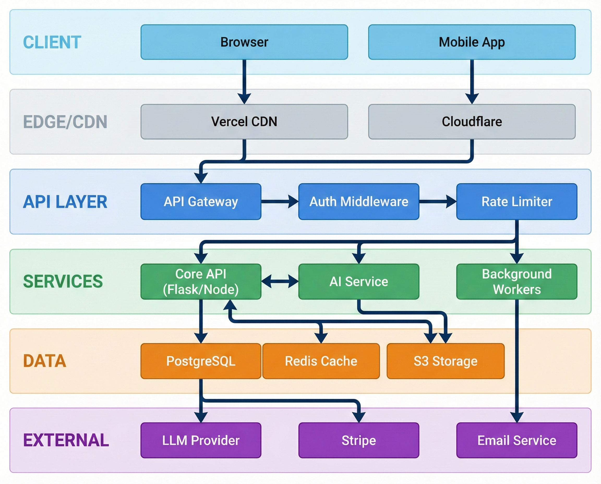

A typical architecture for AI-powered SaaS applications I build.

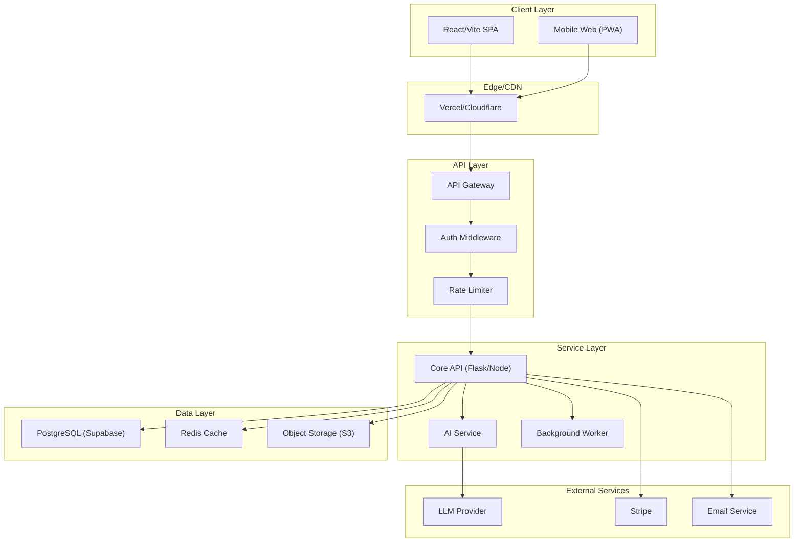

### Key Design Decisions

- **Edge-first delivery** for static assets and initial page loads
- **Middleware chain** for auth, rate limiting before hitting business logic
- **Background workers** for long-running AI tasks (avoid timeout issues)
- **Caching layer** for LLM responses and computed data

---

## 2. AI/LLM Integration Architecture

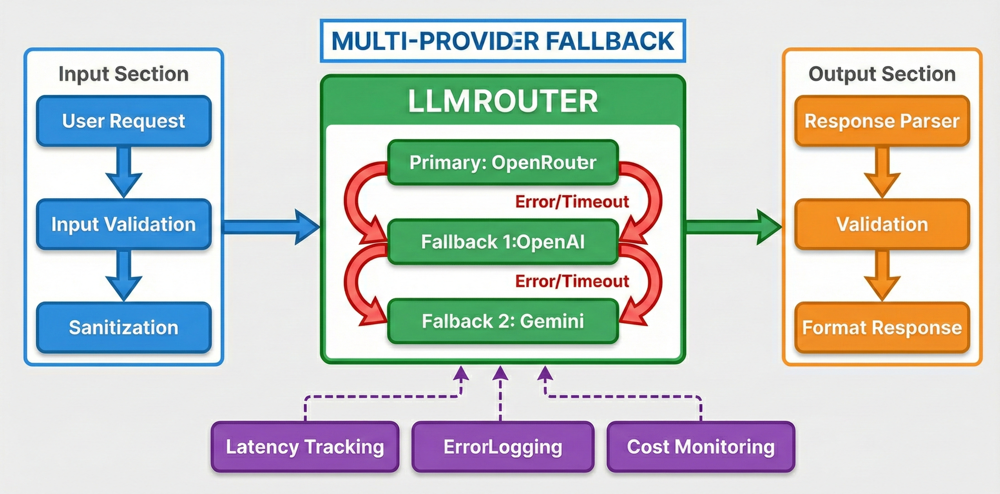

Pattern for building reliable LLM-powered features with fallback and monitoring.

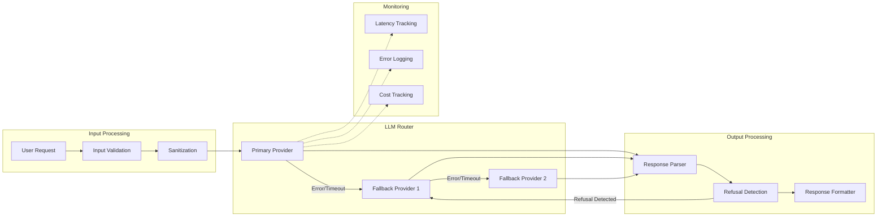

### Key Features

1. **Multi-provider fallback** - Automatic failover when primary provider fails
2. **Refusal detection** - Detect when LLM refuses to answer and retry with different provider
3. **Cost tracking** - Monitor spend per provider for optimization
4. **Response validation** - Ensure output matches expected format

---

## 3. Document Processing Pipeline

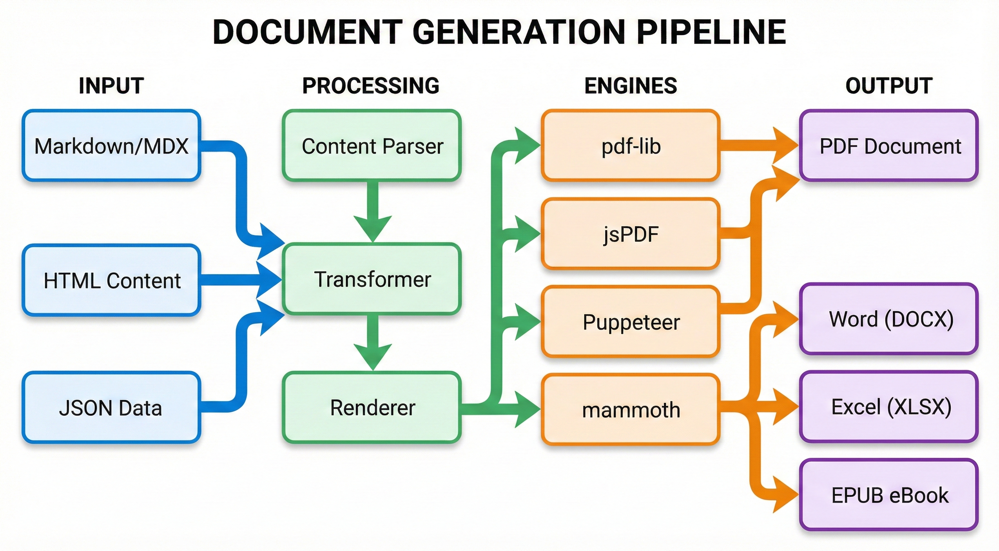

Architecture for OCR and document processing systems.

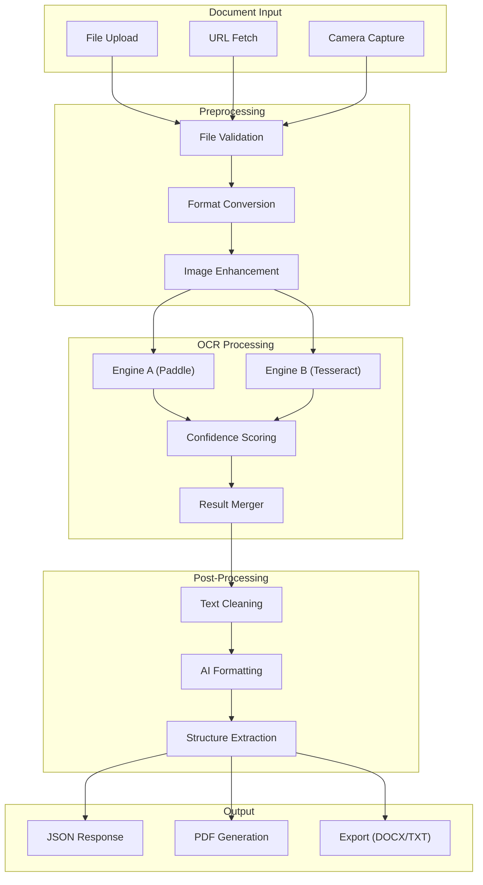

### Multi-Engine Strategy

- **Run multiple OCR engines in parallel** for better accuracy
- **Confidence scoring** to select best result
- **Fallback logic** if primary engine fails
- **AI post-processing** to clean and structure raw OCR output

---

## 4. Background Worker Architecture

Pattern for handling long-running tasks without blocking user requests.

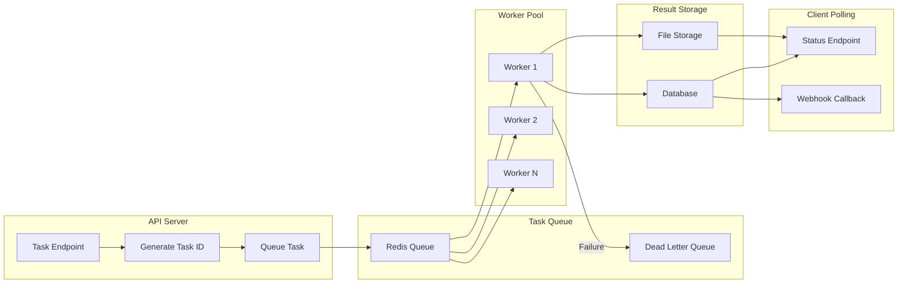

### Implementation Notes

- **Immediate task ID return** - User gets ID instantly, polls for result
- **Idempotent workers** - Safe to retry failed tasks
- **Dead letter queue** - Failed tasks don't block the system
- **Webhook option** - For clients that prefer push over poll

---

## 5. Authentication & Authorization Flow

Typical auth flow for SaaS applications with subscription tiers.

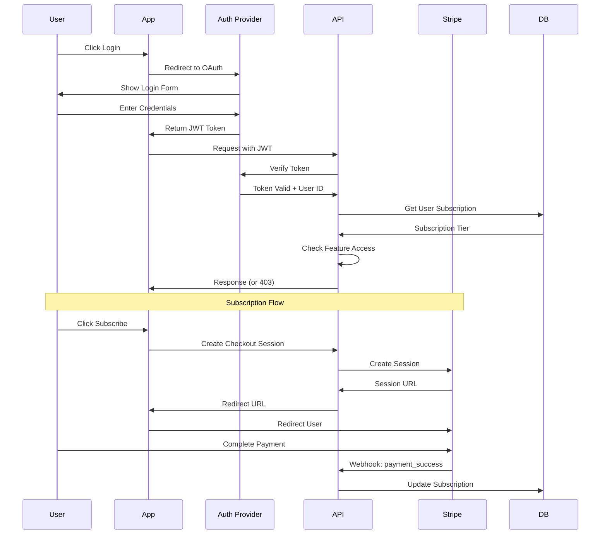

### Security Considerations

- **JWT tokens** with short expiry, refresh token pattern
- **Server-side subscription check** on every protected request
- **Webhook signature verification** for Stripe events
- **Feature flags** tied to subscription tier

---

## 6. Computer Vision / Image Analysis Pipeline

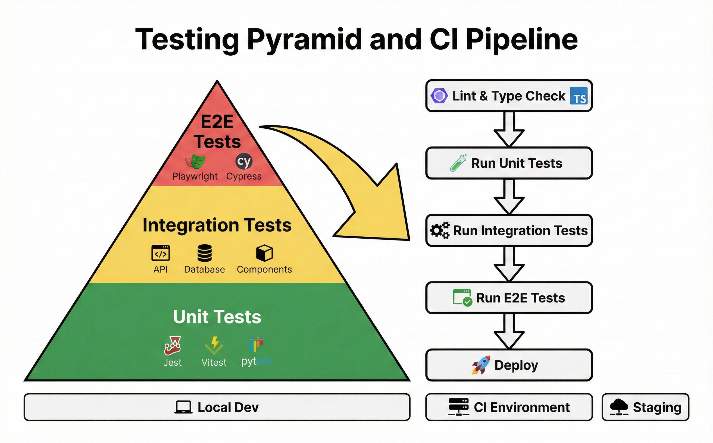

Architecture for floor plan analysis and image processing systems.

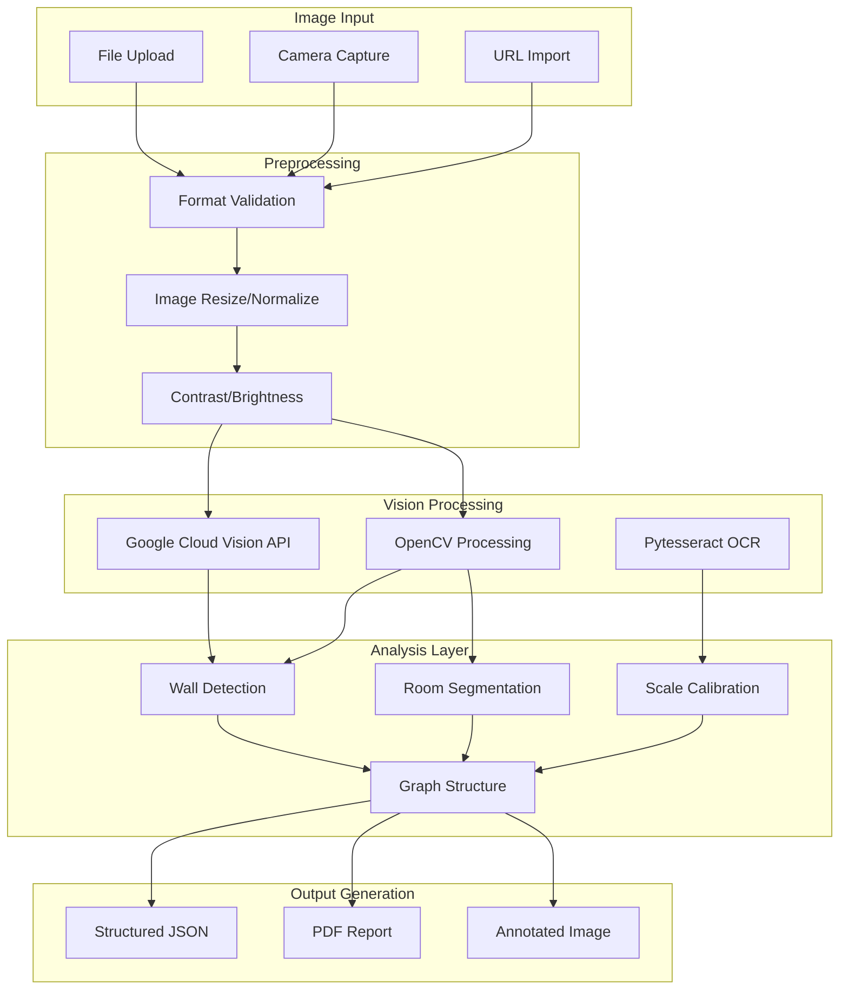

### Key Components

- **Multi-source input** - Upload, camera, or URL fetch
- **Google Cloud Vision** for text detection and image labeling
- **OpenCV** for contour detection, morphological operations
- **Pytesseract** for OCR of measurements and labels
- **Skeleton graph** for structural representation
- **Multiple outputs** - JSON data, annotated images, PDF reports

---

## 7. Document Generation Pipeline

Architecture for converting content to various document formats.

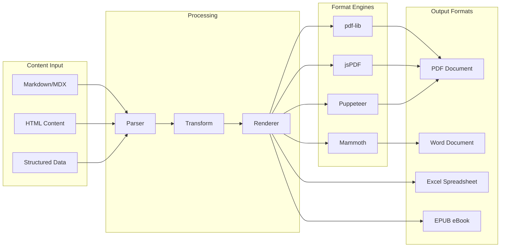

### Implementation Notes

- **pdf-lib** for programmatic PDF creation and manipulation
- **jsPDF** for client-side PDF generation
- **Puppeteer** for HTML-to-PDF with full CSS support
- **mammoth** for Word document parsing, **docx** for generation
- **xlsx** for Excel file handling
- **Mermaid** and **KaTeX** integration for diagrams and math

---

## Next Steps

These diagrams represent patterns, not specific implementations. In an interview, I can:

1. Dive deeper into any component
2. Discuss alternative approaches I considered
3. Explain specific challenges I faced
4. Show how these patterns adapt to different requirements
